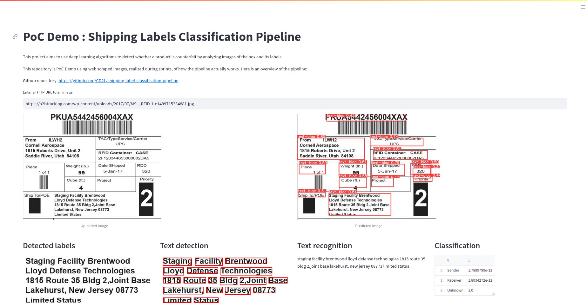

# Shipping Label Classification Pipeline

This project aims to use deep learning algorithms to detect whether a product is counterfeit by analyzing images of the box and its labels.

This repository is PoC Demo using web scraped images, realized during sprints, of how the pipeline actually works.

## Dependencies
The pipeline requires a number of packages to run. You can install them in a virtual environment on your machine via the command :
```shell
git clone https://github.com/ultralytics/yolov5
cd ./yolov5
pip install -r ./requirements.txt
cd ..
pip install -r ./requirements.txt
```

## Getting started
After cloning this repository, you can now run this command:
```shell
streamlit run ./demo.py
```

Once the service is up,  you can interact with its UI: [http://localhost:8501](http://localhost:8501).

## Demo

